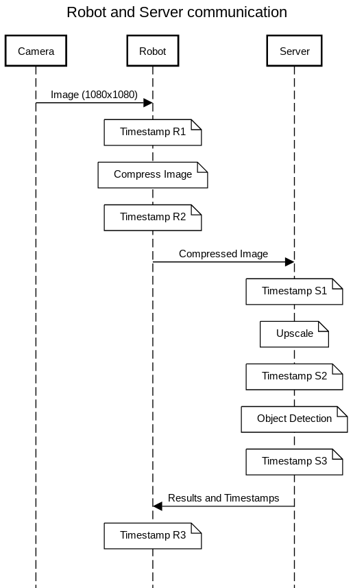

# Table of Contents
* Abstract
* [Introduction](#1-introduction)
* [Related Work](#2-related-work)
* [Technical Approach](#3-technical-approach)
* [Evaluation and Results](#4-evaluation-and-results)
* [Discussion and Conclusions](#5-discussion-and-conclusions)
* [References](#6-references)

# Abstract

Lossy compression is a commonly used technique in different fields, especially embedded devices. However, its effects on object classification still need to be investigated. In this project, we analyzed the effects of lossy compression of images on the object detection model. We tradeoff of model accuracy and latency of sending images over a network and performing the compression. We analyzed four different compression algorithms on our image dataset and collected the request time and model accuracy. We found that the bicubic downscaling algorithm minimized the system’s latency because the downscaling computational time was the most significant term in the overall latency. Additionally, we found that the bilinear downscaling algorithm caused the smallest reduction in model accuracy, even when the image was downscaled 10x. Overall we found the bicubic and bilinear algorithms had a reasonable tradeoff between latency and model accuracy.

# 1. Introduction

* Motivation & Objective: 
    Embedded and Internet of Things (IoT) devices are becoming more and more important these days. They often rely on Artificial Intelligence to make them more powerful. However, embedded devices normally do not have powerful computing capabilities to do complicated tasks, so it’s common to send data to the server, which has stronger computing power, to process. In our project, we built a robot avoiding obstacles while it’s running in the building. The robot will capture the image in front of it and send it to the server to tell whether there’s an obstacle. We analyzed the trade-off between lossy compression versus model accuracy and request time. We used two Raspberry Pis, one as client, one as server, to emulate the scenario of sending images to server to perform object detection, then send back results to client.
    
* State of the Art & Its Limitations:
    Although lossy compression is widely used nowadays, we are still not very clear about the trade-off. Lossy compression could cause the negative result because of the information loss. However, it can speed up the system process time at the same time. The idea of compressing images before running through neural networks has been explored in the past. Previous papers have primarily explored JPEG compression and HEVC compression methods and their effect on neural networks. In some use cases, compression had minimal effect on object detection accuracy and even improved performance in some cases [3]. However, in other studies, compression decreased the accuracy [2]. The state of the art also includes some methods of mitigating accuracy loss. In [2], the authors created an importance map based on the first convolution layers and used it to guide the HEVC bit allocation. Other papers trained neural networks directly on JPEG data [5] and achieved reasonable accuracy.

* Novelty & Rationale:
    Existing papers often investigate the impact of JPEG and HEVC compression algorithms on object detectors. Our approach instead investigates the impact of downscaling with other algorithms such as Lanczos, bilinear, bicubic and hamming downscaling. Additionally, previous papers investigated the problem in different domains. In [3], the authors explored the impact of compression in high resolution satellite images. Our project focuses on small images captured by robots.
    
* Potential Impact:
    It could help us to have a better understanding of the impact of the compression on the images, time for request and resulting classification. As a result, we could know how much compression should be applied to images to achieve certain accuracy and request time.
    
* Challenges:
    One challenge is minimizing the latency of communication between the robot and the edge device. There is a risk that the latency will be too large and moving the computation to the edge device will make the system not responsive enough to avoid obstacles in real time. Another challenge is that the robot has limited computational power. Compressing the image before sending it may increase the total latency if compressing takes much longer than sending the data. 

* Requirements for Success:
    We will need two Raspberry Pis. One is serving as a client that has a motor controller and a camera to take pictures. One is serving as a server to receive pictures and run the object detection model and send results back to the client. For client-server communication, we use HTTP as our communication protocol over Wi-Fi. For image compression, we have knowledge about different image and video compression strategies and we will need to find optimized algorithms for the ones which we evaluate.

* Metrics of Success:
    One metric for success is the quality of our comparison between the lossy compression and the request time and being able to explain the differences in their performances. One metric for success is the accuracy and the speed of the model. We will need a model that can detect obstacles accurately and fast. At the same time, the model should not be overfitting or underfitting. We will use Average Precision (AP) which is a popular metric to measure the accuracy of the object detection model. Lastly, one important criteria for success is whether the robot will be able to avoid obstacles without being unreasonably slow.

# 2. Related Work

In a paper titled “High Efficiency Compression for Object Detection” [2], the authors created a video compression algorithm design for deep neural network based object detectors. They created an importance map from the first convolutional layers of the object detector and made a compression algorithm which uses this information to avoid losing important features. This allowed them to have bit savings of 7% while maintaining similar accuracy. 

In a paper titled “The effect of lossy image compression on object based image classification - WorldView-2 case study” [3], the authors analyzed the impact of JPEG 2000 compression on object classification in high resolution satellite images. The tested two object detectors, one based on kth nearest neighbor and the other based on vector support machines. They found that the effect of lossy compression is minimal, even when the compression ratio is 30:1.

In a paper titled “Deep Feature Compression for Collaborative Object Detection” [4], the authors proposed a novel approach to collaborative computation object detection. The mobile device executes the first layers, sends a lossy compressed version of the feature outputs and the server executes the remaining layers of the network. They found the compression of features affects accuracy but if the second half of the model is retrained with compressed features, the model’s accuracy improves.

# 3. Technical Approach

We used two Raspberry Pis, one Raspberry Pi v1.2 B on the robot to control it and another Raspberry Pi 4 model B which will perform the object detection. The robot is equipped with a Raspberry Pi camera which takes images with resolution of 1080x1080. Depending on the experiment, the robot compresses the image to 416x416, 256x256 or 128x128. The robot transmits these images to the server which then runs the object detection algorithm and lets the robot know if there is an obstacle in front of it. If there is an obstacle, the robot avoids it by moving horizontally and then continuing on its forward path.

The robot downscales the image using one of four existing algorithms: bilinear downscaling, bicubic downscaling, lanczos downscaling and hamming downscaling.

We used HTTP over Wi-Fi for communication between the robot and the edge device. 

Unfortunately, we were not able to reduce the latency to the point where the robot could continually stream images and respond in real time. In order to compensate for this latency, the robot pauses frequently to give the object detection enough time. 

We used YOLOv3-tiny as our object detection model. The reason why we choose it is that it’s a very small model as well for low-power devices, such as raspberry pi. We used “cups” as our obstacles, which is easy to get and is one of the labels in the model.

# 4. Evaluation and Results

We evaluated the different compression methods by first taking 120 images from the robot’s camera without any downscaling. Then using this existing set of images, we programmed the robot to downscale these images to different resolutions using different algorithms and send these images to the server. Both the robot and the server will record the time it takes to perform certain operations such as downscaling the image and the server processing time. Figure 1 shows the time intervals that were recorded by showing the locations where timestamps were taken. 

  

  Figure 1: Details on the message exchanged between the robot and the server and the points where timestamps are taken

The data we recorded does not store the timestamps but differences between certain timestamps. The server always uses the same upscaling algorithm (bicubic) while the robot uses different downscaling methods based on the experiment. After the robot downscales the image, it will encode it in JPEG with JPEG quality set to 75% and transmit to the server.

During experimentation, we noticed that occasionally the time for the whole process would randomly spike. We determined that this extra latency came from random increases in the time it takes to transmit the image over Wi-Fi. To remove these outliers, we made the robot send each image 5 times. During calculations, we used the median of these 5 repetitions to eliminate outliers due to random network conditions.

Figure 2 shows the turnaround time for the system when using different downscaling algorithms and final image sizes. We computed the turnaround times by computing R3-R1 where R1 and R3 are defined in Figure 1.

  

  Figure 2: Turnaround time with different compression methods and image sizes

# 5. Discussion and Conclusions

We conclude that downscaling and upscaling images can achieve reasonable accuracy in object detectors. We also concluded that one key bottleneck to such a system is the downscaling time on the embedded device. If the embedded device does not have enough computational resources, then downscaling can add significant latency. We also noticed that on fast communications such as Wifi and even on slower links like Zigbee, the downscaling time was more significant than the network latency. Thus algorithms which took less time to downscale outperformed algorithms which reduced image size more but took longer to run. Thus the bicubic algorithm performed best in terms of total latency of the system. 

Additionally, we found that the bilinear algorithm downscaling algorithm had the least detrimental effect on the Average Precision of the model. 

To make our project more representative, we need to test our model with multiple classes. Also, we could try different combinations of downscaling algorithms and upscaling algorithms, such as the Gaussian pyramid and Laplacian Pyramids. On top of that, since we calculated the results based on the Zigbee transmission rate and image size which may not be accurate, we should try using Zigbee in our experiments. Another point is pipelining, we can speed up the time by running the process asynchronously, instead of waiting for the server’s response.

# 6. References

[1] https://github.com/BlackMagicAI/Tiny-Yolo-3

[2] https://ieeexplore.ieee.org/abstract/document/8462653/

[3] https://www.researchgate.net/publication/276022062_The_effect_of_lossy_image_compression_on_object_based_image_classification_-_WorldView-2_case_study

[4] https://ieeexplore.ieee.org/abstract/document/8451100?casa_token=oz9XJxo-bxsAAAAA:H6HK6NrhMukwp8EH0JuR1mnDSSpBPonqzhI3tLtldPA3DuXpTTpbh8cv80tlsDcrfxIZjKPh4w

[5] https://arxiv.org/pdf/2007.14314.pdf

[6] https://imaginghub.com/blog/26-comparison-of-wifi-bluetooth-low-energy-and-zigbee-for-wireless-data-transfer

